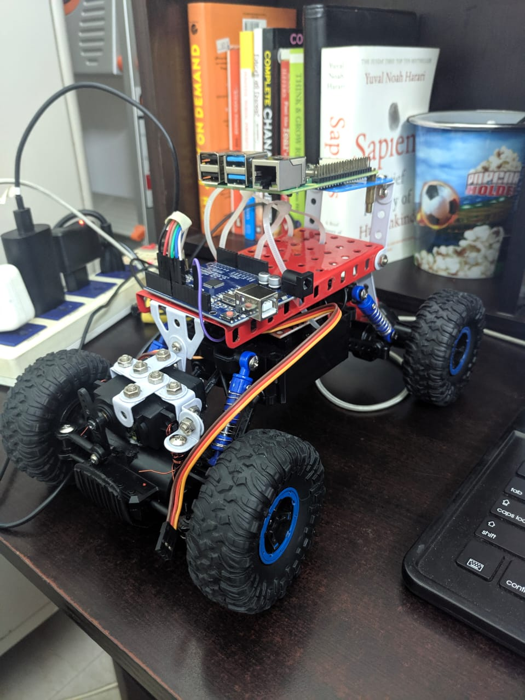
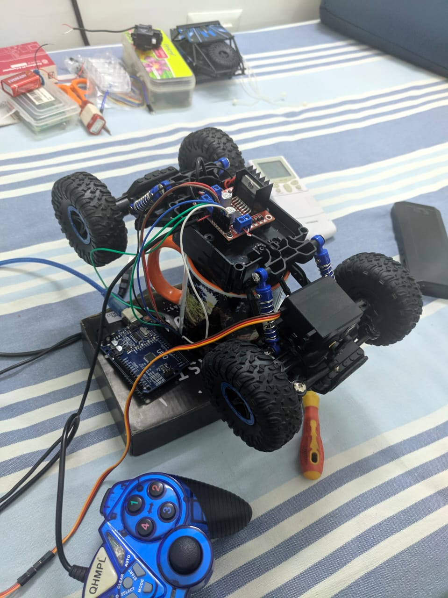
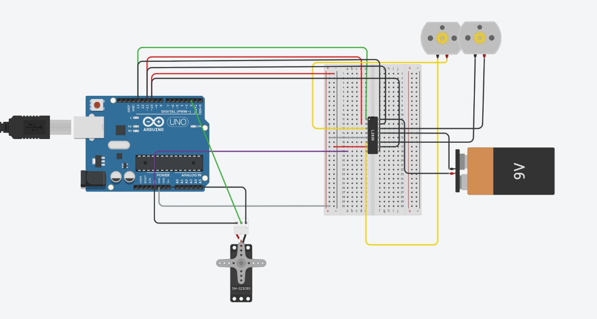

# Autonomous_RC_Car
Made a diy Autonomous RC Car using ROS, Raspberry Pi-4,Arduino and L298n Motor driver.
## Prerequisites
1. Raspbian OS on Raspberry Pi4
2. ROS Melodic Installed
3. Arduino IDE
4. Python 2.7 and 3.7 installed
5. RP-LIDAR SDK
##STEPS FOR TELE-OPERATION
1. run `roscore`
2. export current IP : `export ROS_IP= Current IP`
3. export current Master : `export ROS_MASTER_URI= http://current_ip:11311`
4. run rosserial : `rosrun rosserial_python serial_node.py`
5. run python file to publish Command Velocity : file in `/steer_bot/src/drive_servo.py`
6. run joy_node : `rorun joy joy_node`

# Circuit Simulation

